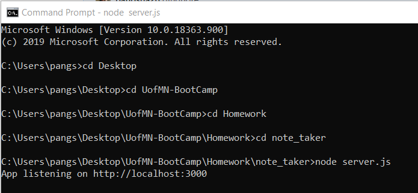
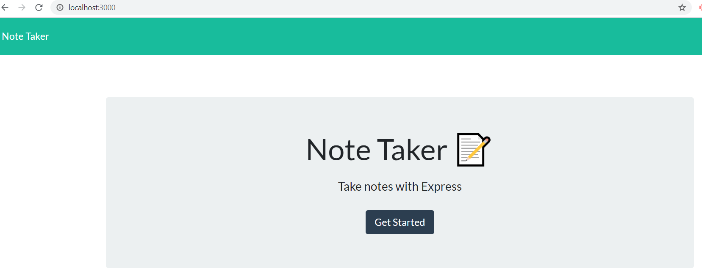
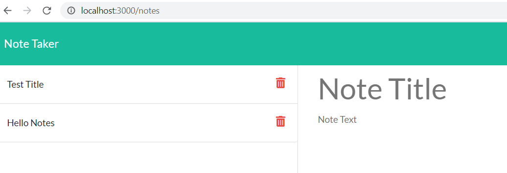
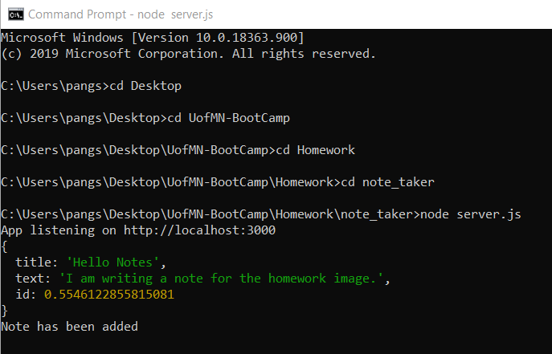
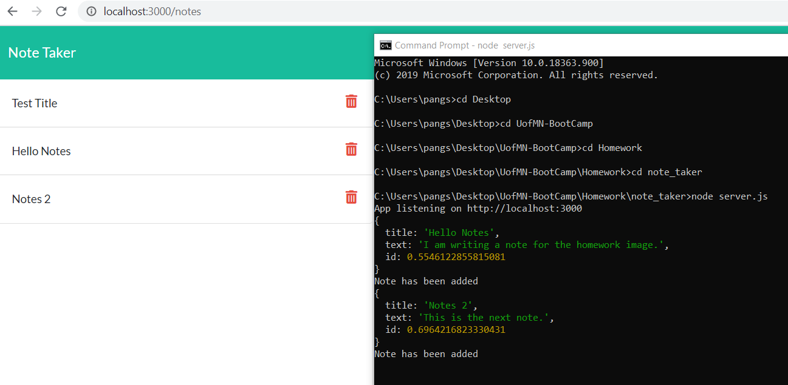
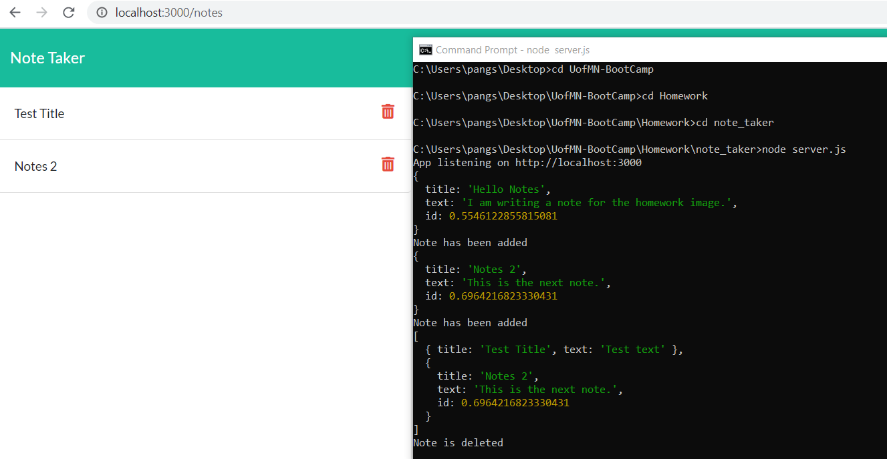

# note_taker

## Project Description
For this homework activiy, we are to create an application that can be used to write, save and delete notes. The application will use an express backend and save and retrieve note data from a JSON file.

## Acceptance Criteria
* Application should allow users to create and save notes.
* Application should allow users to view previously saved notes.
* Application should allow users to delete previously saved notes.

